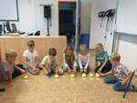
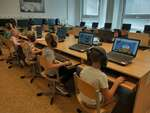

# 2026/2027

Kurz **Programování na Nuselské** bude probíhat od 17. září 2026
a je určen pro děti prvních[1](#footnote1) a druhých
tříd dětí z libovolných škol. Cílem těchto kurzů je rozvíjení
přirozené touhy dětí po poznávání okolního světa s důrazem na
techniku a rozvoj systematického myšlení.

Kurz bude probíhat 1x týdně každý čtvrtek od 13:15 do 14:05 v počítačové
učebně.

V kurzu budeme využívat robůtky [Cubetto](https://www.primotoys.com),
[Beebot](https://www.bee-bot.us/) i [Ozobot](https://ozobot.com/).
Zároveň se budeme věnovat i práci na PC pomocí open source aplikace
[GCompris](https://gcompris.net) a začneme kurzy z platformy
[code.org](https://[www.code.org](https://www.code.org)). Pro zpestření budou kurzy provázeny
tvůrčími aktivitami s papírem, kostkami a jinými rekvizitami.

Cílem kurzu není vzdělat hotového programátora, ale rozvíjet logické
myšlení, algoritmizaci a jiné vlastnosti, které se dětem budou hodit
při studiu jakéhokoliv oboru.

Kurz bude organizován a veden [Lukášem Doktorem](../lectors/ldoktor)

* * * * * * * * *

## 1. hodina (2026-09-17)

* Seznámení s Beeboty - většina znala, takže jsme jen rychle prolétli základní ovládání
* Test ovládání myši a klávesnice - [zvěřinec na déčku](https://decko.ceskatelevize.cz/tercin-zvireci-svet/zverinec)

  &#9664;
  
  &#9654;
  &times;

<link rel="stylesheet" href="/assets/gallery.css">

<a name="footnote1">1</a>: Dle psychologa [Jeana Piageta](https://cs.wikipedia.org/wiki/Jean\_Piaget)
nelze děti mladší 6-7 let učit systematické vědy, neboť se nacházejí
ve stádiu `názorového (prelogického) myšlení`, které ještě plně
nerespektuje logiku. Ukázka experimentu je ke shlédnutí například
[zde](https://www.youtube.com/watch?v=tQLpysTbFso) (doporučuji vyzkoušet),
výuka mateřského jazyku začíná také daleko dříve, než je děťátko schopné
jej pochopit a přirozeně se vytváří návyky a spoje, jež jednou vedou v
schopnost mluvit a myslet v daném jazyce. Bilingvální výchova pak vede
ke schopnosti mluvit a myslet ve více jazycích. Proto věřím, že správným
přístupem lze začít daleko dříve a sám využívám logické hry, roboty i
počítač ke hře a vlastně i výuce svých dětí takřka od narození.

